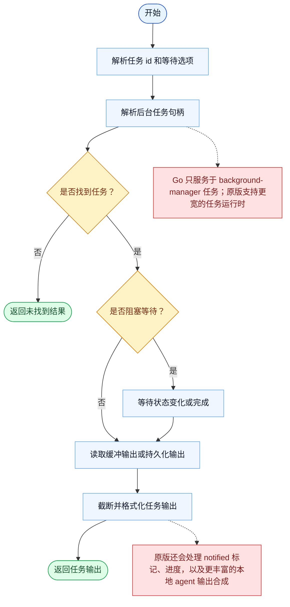

# TaskOutput 一致性报告

- 原版: `src/tools/TaskOutputTool/TaskOutputTool.tsx`
- Go版: `tools/tasks.go`

## 结论

- 摘要: 接口完全对齐；Go 现在已经从持久化 runtime-task store 中读取结果，并具备更好的阻塞行为，但原版异步 task-output 运行时仍更丰富。

## 名称与描述

- 名称一致性: 完全一致。
- 描述一致性: 两边都把这个工具描述为用于读取某个任务的输出，并可选择等待该任务结束。 除“关键差异”外，措辞差别不影响核心语义。

## 参数与类型

- 类型签名: task_id: string，block?: boolean，timeout?: number。
- 参数一致性: 顶层参数名与原版审计结果一致；字段顺序差异不构成语义差异。

## 实现概要

- 核心能力: 读取某个任务的输出，并可选择等待该任务结束。
- 典型场景: 适用于任务已经启动，而模型需要读取其结果，而不是重复执行该工作。
- 核心痛点: 它解决的是多步骤工作的可见性和协同问题，避免模型只能靠自由文本硬记整套计划。
- 主要挑战: 难点在于持久化、依赖边、阻塞语义，以及跨工具、跨会话保持任务状态一致。
- 实现思路一致性: 部分一致。两边都围绕共享的持久化任务系统展开，Go 现在也已镜像更多原版的 scope、加锁和 runtime-task 底座，但原版仍然有更丰富、带 hook 的 app-state 运行时。

## 流程图与决策地图

### 如何阅读这张图

- 先读蓝色主路径，用它理解共享的 happy path。
- 再看黄色菱形，它们是决定工具走哪条分支的判断条件。
- 最后看红色节点，它们标出 Go 与 `../src` 真正分叉的位置，或被有意排除的范围。

### 决策点

- `是否找到任务？` 决定工具能否真正查看一个活跃后台句柄。
- `是否阻塞等待？` 控制是立即返回输出，还是等待更多任务进度之后再返回。

### 差异热点

- Go 路径之所以明显更窄，是因为它只认识 background task manager 里的那几类任务。
- 原版 task-output 运行时覆盖了更多任务类型，并且在通知、进度和 agent 输出合成上有更丰富的后处理。

## 输出与格式

- 输出对比: 原版返回 typed 的 task-output 载荷；Go 则返回来自持久化 runtime-task 底座的纯文本结果，且截断与阻塞语义比之前更强。

## 关键差异

- typed 的 task-output 丰富度以及更宽的原版异步运行时，在 Go 中仍未完全复现。
