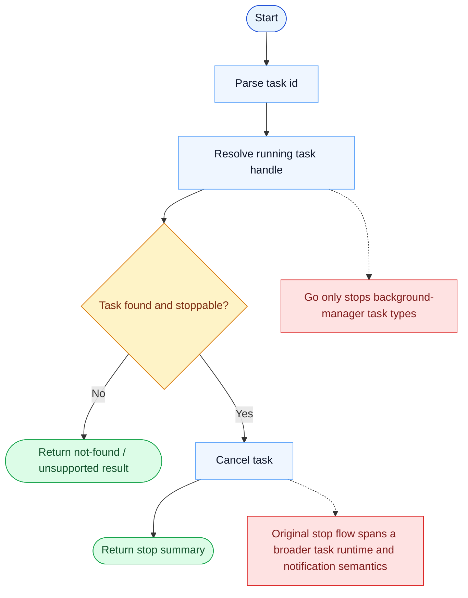

# TaskStop Parity Report

- Original: `src/tools/TaskStopTool/TaskStopTool.ts`
- Go: `tools/tasks.go`

## Verdict

- Summary: Exact surface; the stop contract is aligned, and it now operates against the persisted runtime-task substrate as well as in-process tasks.

## Name And Description

- Name parity: exact.
- Description parity: Both versions describe the tool around the same core capability: Stops a running task by task ID or shell ID. Wording differences are minor unless called out under key gaps.

## Parameters And Types

- Type signature: task_id?: string, shell_id?: string.
- Parameter parity: top-level parameter names match the original audit; ordering differences are non-semantic.

## Implementation Overview

- Core capability: Stops a running task by task ID or shell ID.
- Typical scenarios: Use it when a backgrounded or delegated task should no longer continue running.
- Core pain point addressed: It addresses visibility and coordination for multi-step work so the model does not have to track the whole plan in free text.
- Main challenges: The hard parts are persistence, dependency edges, blocking semantics, and keeping task state consistent across tools and sessions.
- Strategy consistency: Partially consistent. Both versions revolve around a shared persistent task system, and Go now mirrors more of the original scope, locking, and runtime-task substrate, but the original still has a richer hook-aware app-state runtime.

## Visual Flow And Decision Map

### How To Read The Diagram

- Read the blue path first to understand the shared happy path.
- Read the yellow diamonds next; they are the branch conditions that decide which path the tool takes.
- Read the red boxes last; they mark exact places where Go diverges from `../src`, or where a path is intentionally out of scope.

### Decision Points

- `Task found and stoppable?` decides whether the tool can cancel a real running task or only explain that the task is missing / unsupported.

### Flow-Divergence Hotspots

- The stop path is simple once a cancellable task handle exists.
- The main difference is task coverage: Go stops only background-manager tasks, while the original covers a richer task runtime.

## Output And Format

- Output comparison: The original returns a structured stop result; Go returns a JSON string summary backed by the newer runtime-task substrate.

## Key Gaps

- The remaining gaps are mainly hook/app-state integration, richer typed results, and the broader original teammate/runtime lifecycle.
