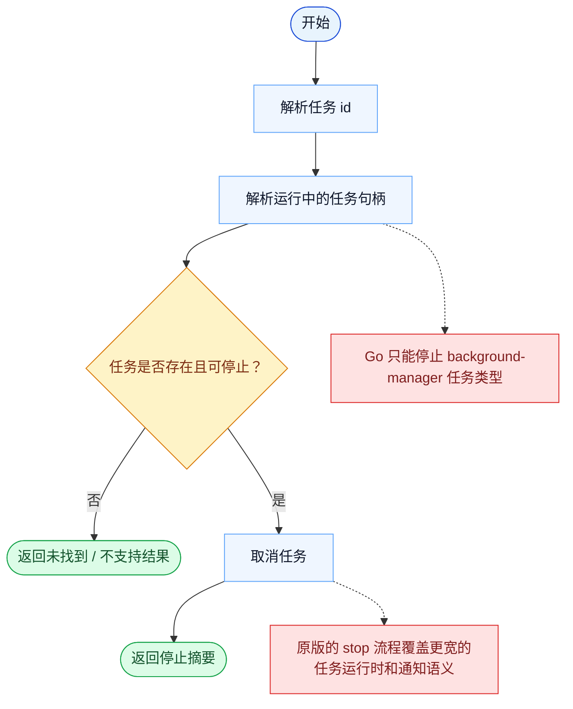

# TaskStop 一致性报告

- 原版: `src/tools/TaskStopTool/TaskStopTool.ts`
- Go版: `tools/tasks.go`

## 结论

- 摘要: 接口完全对齐；停止契约已对齐，而且现在也会作用于持久化 runtime-task 底座，而不只是进程内任务。

## 名称与描述

- 名称一致性: 完全一致。
- 描述一致性: 两边都把这个工具描述为用于按 task ID 或 shell ID 停止一个正在运行的任务。 除“关键差异”外，措辞差别不影响核心语义。

## 参数与类型

- 类型签名: task_id?: string，shell_id?: string。
- 参数一致性: 顶层参数名与原版审计结果一致；字段顺序差异不构成语义差异。

## 实现概要

- 核心能力: 按 task ID 或 shell ID 停止一个正在运行的任务。
- 典型场景: 适用于某个后台或委派任务不应继续运行时。
- 核心痛点: 它解决的是多步骤工作的可见性和协同问题，避免模型只能靠自由文本硬记整套计划。
- 主要挑战: 难点在于持久化、依赖边、阻塞语义，以及跨工具、跨会话保持任务状态一致。
- 实现思路一致性: 部分一致。两边都围绕共享的持久化任务系统展开，Go 现在也已镜像更多原版的 scope、加锁和 runtime-task 底座，但原版仍然有更丰富、带 hook 的 app-state 运行时。

## 流程图与决策地图

### 如何阅读这张图

- 先读蓝色主路径，用它理解共享的 happy path。
- 再看黄色菱形，它们是决定工具走哪条分支的判断条件。
- 最后看红色节点，它们标出 Go 与 `../src` 真正分叉的位置，或被有意排除的范围。

### 决策点

- `任务是否存在且可停止？` 决定工具是可以取消一个真实运行中的任务，还是只能解释任务缺失 / 不受支持。

### 差异热点

- 一旦存在可取消的任务句柄，stop 路径本身很简单。
- 主要差异在任务覆盖面：Go 只能停止 background-manager 任务，而原版覆盖的是更丰富的任务运行时。

## 输出与格式

- 输出对比: 原版返回结构化停止结果；Go 返回由新 runtime-task 底座支撑的 JSON 字符串摘要。

## 关键差异

- 剩余差距主要集中在 hook/app-state 集成、更丰富的 typed 结果，以及更宽的原版 teammate/runtime 生命周期。
