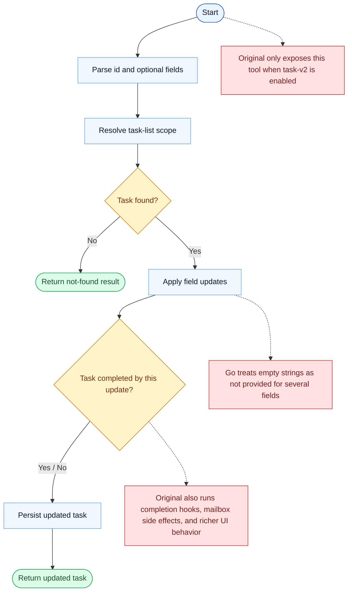

# TaskUpdate Parity Report

- Original: `src/tools/TaskUpdateTool/TaskUpdateTool.ts`
- Go: `tools/tasks.go`

## Verdict

- Summary: Exact surface; the update contract is aligned, and Go now updates tasks inside a persistent, scope-aware, locked backend.

## Name And Description

- Name parity: exact.
- Description parity: Both versions describe the tool around the same core capability: Mutates task fields, relationships, and status inside the shared task system. Wording differences are minor unless called out under key gaps.

## Parameters And Types

- Type signature: taskId: string, subject?: string, description?: string, activeForm?: string, status?: string, addBlocks?: string[], addBlockedBy?: string[], owner?: string, metadata?: object.
- Parameter parity: top-level parameter names match the original audit; ordering differences are non-semantic.

## Implementation Overview

- Core capability: Mutates task fields, relationships, and status inside the shared task system.
- Typical scenarios: Use it when tracked work changes state, ownership, dependencies, or descriptive metadata.
- Core pain point addressed: It addresses visibility and coordination for multi-step work so the model does not have to track the whole plan in free text.
- Main challenges: The hard parts are persistence, dependency edges, blocking semantics, and keeping task state consistent across tools and sessions.
- Strategy consistency: Partially consistent. Both versions revolve around a shared persistent task system, and Go now mirrors more of the original scope, locking, and runtime-task substrate, but the original still has a richer hook-aware app-state runtime.

## Visual Flow And Decision Map

### How To Read The Diagram

- Read the blue path first to understand the shared happy path.
- Read the yellow diamonds next; they are the branch conditions that decide which path the tool takes.
- Read the red boxes last; they mark exact places where Go diverges from `../src`, or where a path is intentionally out of scope.

### Decision Points

- `Task found?` decides whether updates can even be applied.
- `Task completed by this update?` is where the original branches into task-completion hooks and side effects.

### Flow-Divergence Hotspots

- The shared path is apply-update-and-persist.
- The original wraps completion transitions in hooks, mailbox side effects, and richer UI changes; Go currently does not.
- Go also simplifies several field semantics by treating empty strings as missing input.

## Output And Format

- Output comparison: The original returns a structured update result; Go returns a plain-text summary on top of the newer persistent task substrate.

## Key Gaps

- The remaining gaps are mainly hook/app-state integration, richer typed results, and the broader original teammate/runtime lifecycle.
