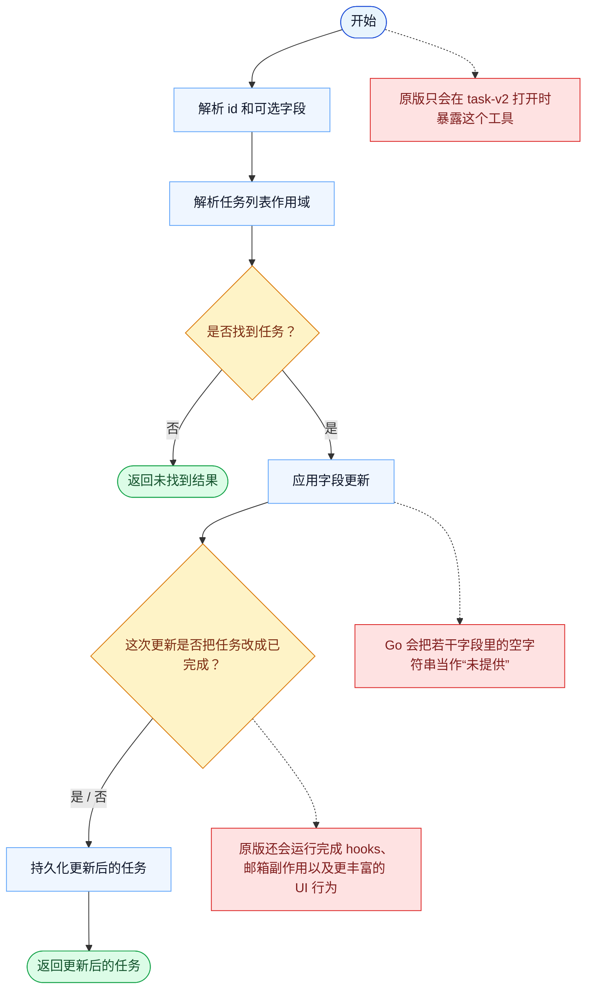

# TaskUpdate 一致性报告

- 原版: `src/tools/TaskUpdateTool/TaskUpdateTool.ts`
- Go版: `tools/tasks.go`

## 结论

- 摘要: 接口完全对齐；更新契约已对齐，Go 现在也已经是在持久化、scope-aware、带锁的后端里更新任务。

## 名称与描述

- 名称一致性: 完全一致。
- 描述一致性: 两边都把这个工具描述为用于在共享任务系统中修改任务字段、关系和状态。 除“关键差异”外，措辞差别不影响核心语义。

## 参数与类型

- 类型签名: taskId: string，subject?: string，description?: string，activeForm?: string，status?: string，addBlocks?: string[]，addBlockedBy?: string[]，owner?: string，metadata?: object。
- 参数一致性: 顶层参数名与原版审计结果一致；字段顺序差异不构成语义差异。

## 实现概要

- 核心能力: 在共享任务系统中修改任务字段、关系和状态。
- 典型场景: 适用于被跟踪的工作发生了状态、所有权、依赖关系或描述元信息变化时。
- 核心痛点: 它解决的是多步骤工作的可见性和协同问题，避免模型只能靠自由文本硬记整套计划。
- 主要挑战: 难点在于持久化、依赖边、阻塞语义，以及跨工具、跨会话保持任务状态一致。
- 实现思路一致性: 部分一致。两边都围绕共享的持久化任务系统展开，Go 现在也已镜像更多原版的 scope、加锁和 runtime-task 底座，但原版仍然有更丰富、带 hook 的 app-state 运行时。

## 流程图与决策地图

### 如何阅读这张图

- 先读蓝色主路径，用它理解共享的 happy path。
- 再看黄色菱形，它们是决定工具走哪条分支的判断条件。
- 最后看红色节点，它们标出 Go 与 `../src` 真正分叉的位置，或被有意排除的范围。

### 决策点

- `是否找到任务？` 决定更新是否有机会真正落地。
- `这次更新是否把任务改成已完成？` 是原版切入 task-completion hooks 和副作用分支的位置。

### 差异热点

- 共享路径就是应用更新并持久化。
- 原版会把任务完成状态切换包进 hooks、邮箱副作用和更丰富的 UI 变化里；Go 当前没有这些语义。
- 此外，Go 还通过把空字符串视为缺失输入，简化了若干字段语义。

## 输出与格式

- 输出对比: 原版返回结构化更新结果；Go 返回的是基于新持久化任务底座的纯文本摘要。

## 关键差异

- 剩余差距主要集中在 hook/app-state 集成、更丰富的 typed 结果，以及更宽的原版 teammate/runtime 生命周期。
