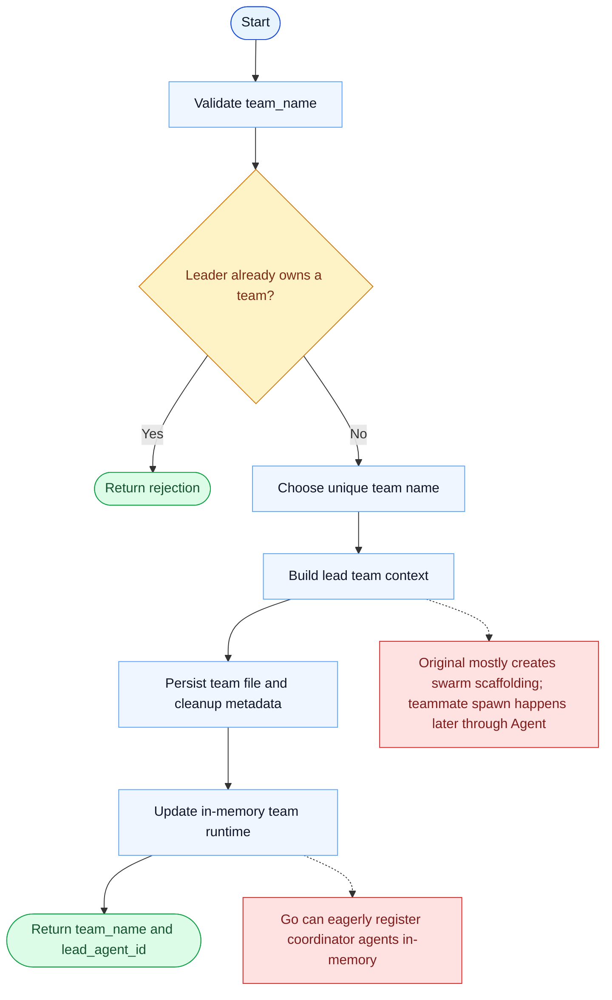

# TeamCreate Parity Report

- Original: `src/tools/TeamCreateTool/TeamCreateTool.ts`
- Go: `tools/team.go`, `tools/send_message_routing.go`

## Verdict

- Summary: Exact surface; Go now persists richer team metadata and guardrails, but the original swarm runtime is still broader.

## Name And Description

- Name parity: exact.
- Description parity: Both versions describe the tool around the same core capability: Creates a new team context for coordinating multiple agents. Wording differences are minor unless called out under key gaps.

## Parameters And Types

- Type signature: team_name: string, description?: string, agent_type?: string.
- Parameter parity: top-level parameter names match the original audit; ordering differences are non-semantic.

## Implementation Overview

- Core capability: Creates a new team context for coordinating multiple agents.
- Typical scenarios: Use it when a leader should manage parallel workers instead of keeping every responsibility in a single agent transcript.
- Core pain point addressed: It solves team coordination so leader and teammates can share state and responsibility instead of faking parallel work in one transcript.
- Main challenges: The hard parts are persistent team state, member lifecycle, shutdown coordination, and cleanup after work completes.
- Strategy consistency: Partially consistent. Both versions persist team state and route coordination through that state, but the Go runtime is still less complete than the original swarm system.

## Visual Flow And Decision Map

### How To Read The Diagram

- Read the blue path first to understand the shared happy path.
- Read the yellow diamonds next; they are the branch conditions that decide which path the tool takes.
- Read the red boxes last; they mark exact places where Go diverges from `../src`, or where a path is intentionally out of scope.

### Decision Points

- `Leader already owns a team?` prevents one leader session from accumulating conflicting team state.

### Flow-Divergence Hotspots

- Both versions persist lead-owned team state and prepare future coordination.
- The main difference is when teammates are materialized: the original mostly scaffolds first, while Go can register more runtime state eagerly.

## Output And Format

- Output comparison: The original returns structured team metadata; Go returns a JSON string with the same key fields such as team name, team file path, and lead agent ID.

## Key Gaps

- Original teammate spawning and full swarm lifecycle are still richer than the current Go runtime.
