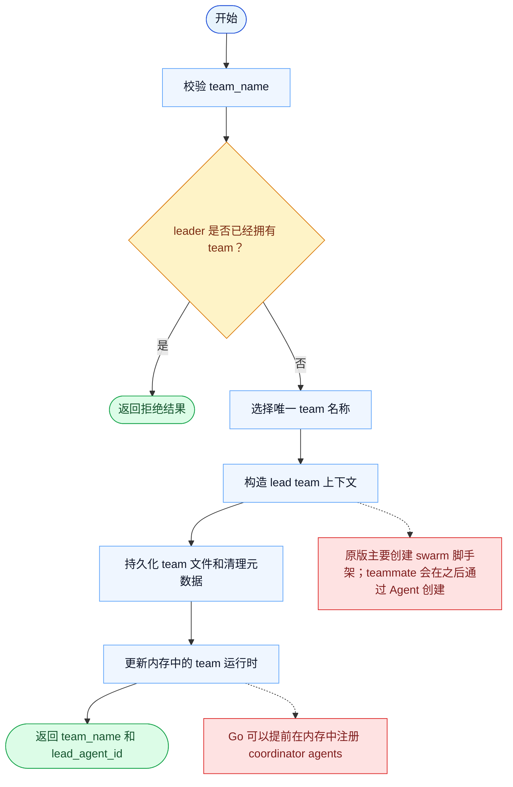

# TeamCreate 一致性报告

- 原版: `src/tools/TeamCreateTool/TeamCreateTool.ts`
- Go版: `tools/team.go`, `tools/send_message_routing.go`

## 结论

- 摘要: 接口完全对齐；Go 现已持久化更丰富的 team 元信息和护栏，但原版 swarm 运行时仍然更宽。

## 名称与描述

- 名称一致性: 完全一致。
- 描述一致性: 两边都把这个工具描述为用于创建一个新的 team 上下文，用于协调多个 agent。 除“关键差异”外，措辞差别不影响核心语义。

## 参数与类型

- 类型签名: team_name: string，description?: string，agent_type?: string。
- 参数一致性: 顶层参数名与原版审计结果一致；字段顺序差异不构成语义差异。

## 实现概要

- 核心能力: 创建一个新的 team 上下文，用于协调多个 agent。
- 典型场景: 适用于 leader 需要管理并行 worker，而不是把所有职责都塞在单一 agent transcript 里。
- 核心痛点: 它解决的是团队协同问题，让 leader 和 teammate 能共享状态与职责，而不是在一条 transcript 里假装并行。
- 主要挑战: 难点在于持久化 team 状态、成员生命周期、关闭协调，以及任务完成后的清理。
- 实现思路一致性: 部分一致。两边都持久化 team 状态并依赖它来做协同，但 Go 运行时仍没有原版 swarm 系统完整。

## 流程图与决策地图

### 如何阅读这张图

- 先读蓝色主路径，用它理解共享的 happy path。
- 再看黄色菱形，它们是决定工具走哪条分支的判断条件。
- 最后看红色节点，它们标出 Go 与 `../src` 真正分叉的位置，或被有意排除的范围。

### 决策点

- `leader 是否已经拥有 team？` 用来阻止同一个 leader 会话积累互相冲突的 team 状态。

### 差异热点

- 两边都会持久化由 lead 拥有的 team 状态，并为后续协同做准备。
- 主要差异在 teammate 的物化时机：原版更多是先搭脚手架，而 Go 可以更早注册运行时状态。

## 输出与格式

- 输出对比: 原版返回结构化 team 元信息；Go 返回 JSON 字符串，并包含 team name、team file path、lead agent ID 等同类关键字段。

## 关键差异

- 原版的 teammate 生成与完整 swarm 生命周期仍比当前 Go 运行时更丰富。
