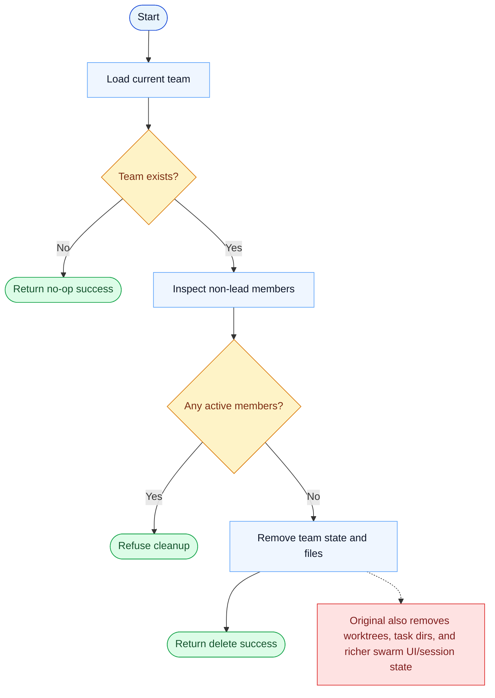

# TeamDelete Parity Report

- Original: `src/tools/TeamDeleteTool/TeamDeleteTool.ts`
- Go: `tools/team.go`, `tools/send_message_routing.go`

## Verdict

- Summary: Exact surface; Go mirrors more of the original active-member cleanup guard now, but full swarm teardown is still broader in the original runtime.

## Name And Description

- Name parity: exact.
- Description parity: Both versions describe the tool around the same core capability: Deletes the current team context and cleans up team-related state. Wording differences are minor unless called out under key gaps.

## Parameters And Types

- Type signature: No input parameters.
- Parameter parity: top-level parameter names match the original audit; ordering differences are non-semantic.

## Implementation Overview

- Core capability: Deletes the current team context and cleans up team-related state.
- Typical scenarios: Use it when coordinated multi-agent work has finished and the team should be shut down cleanly.
- Core pain point addressed: It solves team coordination so leader and teammates can share state and responsibility instead of faking parallel work in one transcript.
- Main challenges: The hard parts are persistent team state, member lifecycle, shutdown coordination, and cleanup after work completes.
- Strategy consistency: Partially consistent. Both versions persist team state and route coordination through that state, but the Go runtime is still less complete than the original swarm system.

## Visual Flow And Decision Map

### How To Read The Diagram

- Read the blue path first to understand the shared happy path.
- Read the yellow diamonds next; they are the branch conditions that decide which path the tool takes.
- Read the red boxes last; they mark exact places where Go diverges from `../src`, or where a path is intentionally out of scope.

### Decision Points

- `Team exists?` decides whether deletion is meaningful or only a harmless no-op.
- `Any active members?` is the safety gate that prevents tearing down team state while live members still exist.

### Flow-Divergence Hotspots

- The active-member guard is now close.
- The remaining divergence is cleanup depth: the original tears down more worktree, task-directory, and swarm-session state than Go currently does.

## Output And Format

- Output comparison: The original returns structured cleanup status; Go returns a JSON string with `success`, `message`, and optional `team_name`.

## Key Gaps

- Full original swarm teardown and session cleanup remain broader than the current Go implementation.
