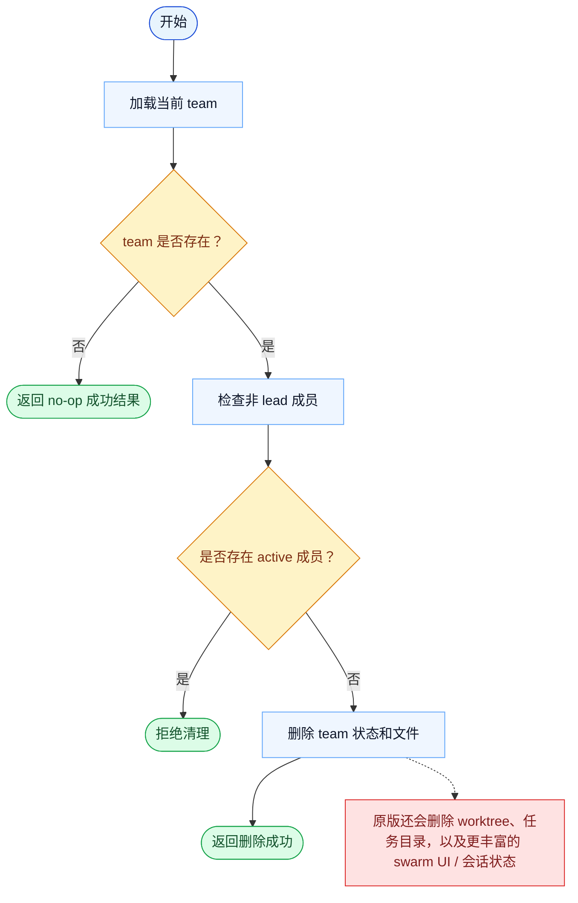

# TeamDelete 一致性报告

- 原版: `src/tools/TeamDeleteTool/TeamDeleteTool.ts`
- Go版: `tools/team.go`, `tools/send_message_routing.go`

## 结论

- 摘要: 接口完全对齐；Go 现在已镜像更多原版的 active-member 清理护栏，但完整 swarm 拆除在原版运行时里仍然更宽。

## 名称与描述

- 名称一致性: 完全一致。
- 描述一致性: 两边都把这个工具描述为用于删除当前 team 上下文并清理 team 相关状态。 除“关键差异”外，措辞差别不影响核心语义。

## 参数与类型

- 类型签名: 无输入参数。
- 参数一致性: 顶层参数名与原版审计结果一致；字段顺序差异不构成语义差异。

## 实现概要

- 核心能力: 删除当前 team 上下文并清理 team 相关状态。
- 典型场景: 适用于多 agent 协同工作已经完成，team 需要被干净地关闭。
- 核心痛点: 它解决的是团队协同问题，让 leader 和 teammate 能共享状态与职责，而不是在一条 transcript 里假装并行。
- 主要挑战: 难点在于持久化 team 状态、成员生命周期、关闭协调，以及任务完成后的清理。
- 实现思路一致性: 部分一致。两边都持久化 team 状态并依赖它来做协同，但 Go 运行时仍没有原版 swarm 系统完整。

## 流程图与决策地图

### 如何阅读这张图

- 先读蓝色主路径，用它理解共享的 happy path。
- 再看黄色菱形，它们是决定工具走哪条分支的判断条件。
- 最后看红色节点，它们标出 Go 与 `../src` 真正分叉的位置，或被有意排除的范围。

### 决策点

- `team 是否存在？` 决定删除是否有意义，还是只是一次无害 no-op。
- `是否存在 active 成员？` 是安全 gate，用来阻止在仍有活跃成员时拆除 team 状态。

### 差异热点

- active-member 保护现在已经比较接近。
- 剩余差异在清理深度：原版会拆除比 Go 当前更多的 worktree、任务目录和 swarm 会话状态。

## 输出与格式

- 输出对比: 原版返回结构化清理状态；Go 返回包含 `success`、`message` 和可选 `team_name` 的 JSON 字符串。

## 关键差异

- 完整的原版 swarm 拆除与 session cleanup 仍比当前 Go 实现更宽。
