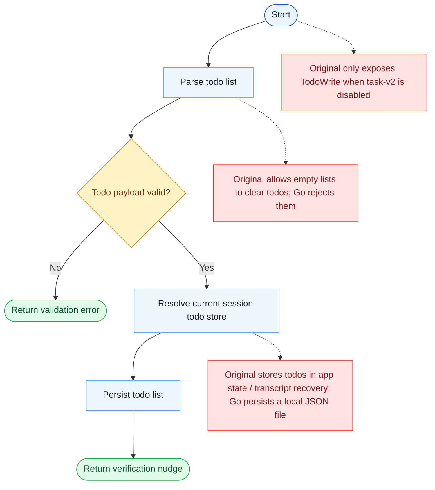

# TodoWrite Parity Report

- Original: `src/tools/TodoWriteTool/TodoWriteTool.ts`
- Go: `tools/todowrite.go`

## Verdict

- Summary: Exact surface; the todo-writing contract is aligned, and Go now routes it through a scope-aware persisted todo store with the original empty-list clearing semantics.

## Name And Description

- Name parity: exact.
- Description parity: Both versions describe the tool around the same core capability: Writes or updates the working todo list through the task system. Wording differences are minor unless called out under key gaps.

## Parameters And Types

- Type signature: todos: Array<{content: string, status: string, activeForm?: string}>.
- Parameter parity: top-level parameter names match the original audit; ordering differences are non-semantic.

## Implementation Overview

- Core capability: Writes or updates the working todo list through the task system.
- Typical scenarios: Use it when the model should make its working plan explicit as a current todo list instead of keeping that plan implicit.
- Core pain point addressed: It addresses visibility and coordination for multi-step work so the model does not have to track the whole plan in free text.
- Main challenges: The hard parts are persistence, dependency edges, blocking semantics, and keeping task state consistent across tools and sessions.
- Strategy consistency: Partially consistent. Both versions revolve around a shared persistent task system, and Go now mirrors more of the original scope, locking, and runtime-task substrate, but the original still has a richer hook-aware app-state runtime.

## Visual Flow And Decision Map

### How To Read The Diagram

- Read the blue path first to understand the shared happy path.
- Read the yellow diamonds next; they are the branch conditions that decide which path the tool takes.
- Read the red boxes last; they mark exact places where Go diverges from `../src`, or where a path is intentionally out of scope.

### Decision Points

- `Todo payload valid?` decides whether the runtime can accept and persist the todo list at all.

### Flow-Divergence Hotspots

- The Go path is explicit and local-file-backed.
- The biggest differences are gating, empty-list semantics, and where todo state lives and gets restored from.

## Output And Format

- Output comparison: The original returns richer task/todo-aware results; Go returns a plain-text summary after updating the persisted todo state.

## Key Gaps

- The remaining gaps are mainly hook/app-state integration, richer typed results, and the broader original teammate/runtime lifecycle.
