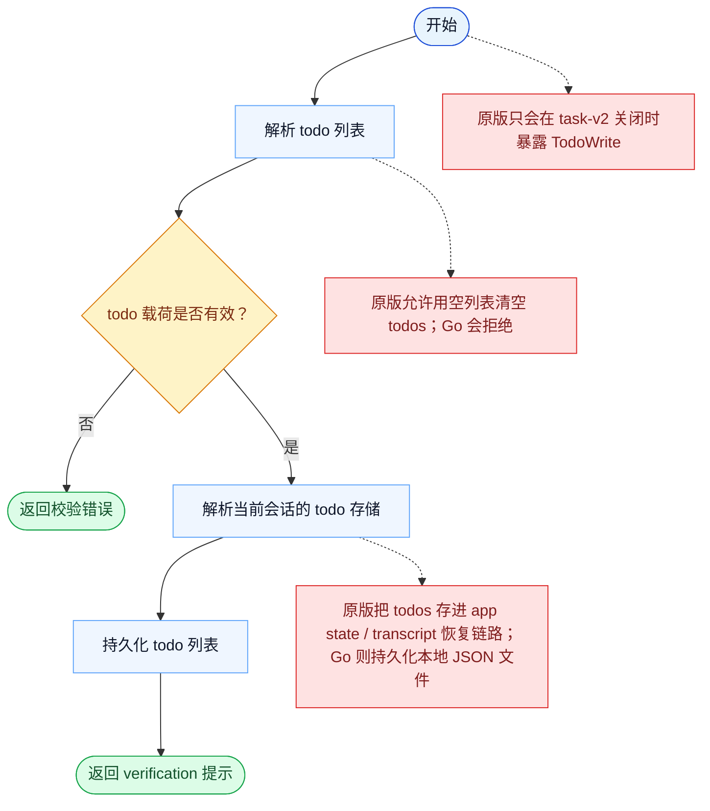

# TodoWrite 一致性报告

- 原版: `src/tools/TodoWriteTool/TodoWriteTool.ts`
- Go版: `tools/todowrite.go`

## 结论

- 摘要: 接口完全对齐；todo 写入契约已对齐，Go 现在也已经把它路由到 scope-aware 的持久化 todo store，并具备原版的空列表清空语义。

## 名称与描述

- 名称一致性: 完全一致。
- 描述一致性: 两边都把这个工具描述为用于通过任务系统写入或更新工作中的 todo 列表。 除“关键差异”外，措辞差别不影响核心语义。

## 参数与类型

- 类型签名: todos: 数组<{content: string，status: string，activeForm?: string}>。
- 参数一致性: 顶层参数名与原版审计结果一致；字段顺序差异不构成语义差异。

## 实现概要

- 核心能力: 通过任务系统写入或更新工作中的 todo 列表。
- 典型场景: 适用于模型需要把自己的工作计划显式化为当前 todo 列表，而不是让计划停留在隐含状态。
- 核心痛点: 它解决的是多步骤工作的可见性和协同问题，避免模型只能靠自由文本硬记整套计划。
- 主要挑战: 难点在于持久化、依赖边、阻塞语义，以及跨工具、跨会话保持任务状态一致。
- 实现思路一致性: 部分一致。两边都围绕共享的持久化任务系统展开，Go 现在也已镜像更多原版的 scope、加锁和 runtime-task 底座，但原版仍然有更丰富、带 hook 的 app-state 运行时。

## 流程图与决策地图

### 如何阅读这张图

- 先读蓝色主路径，用它理解共享的 happy path。
- 再看黄色菱形，它们是决定工具走哪条分支的判断条件。
- 最后看红色节点，它们标出 Go 与 `../src` 真正分叉的位置，或被有意排除的范围。

### 决策点

- `todo 载荷是否有效？` 决定运行时是否可以接受并持久化这份 todo 列表。

### 差异热点

- Go 路径很明确，而且是本地文件持久化。
- 最大的差异在工具暴露 gate、空列表语义，以及 todo 状态到底存在哪里、从哪里恢复。

## 输出与格式

- 输出对比: 原版返回更丰富的 task/todo 感知结果；Go 在更新持久化 todo 状态后返回纯文本摘要。

## 关键差异

- 剩余差距主要集中在 hook/app-state 集成、更丰富的 typed 结果，以及更宽的原版 teammate/runtime 生命周期。
