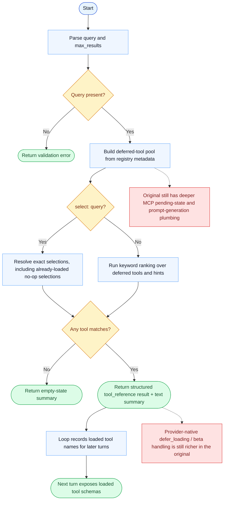

# ToolSearch Parity Report

- Original: `src/tools/ToolSearchTool/ToolSearchTool.ts`
- Go: `tools/tool_search.go`

## Verdict

- Summary: Exact surface; Go now mirrors the key deferred-discovery loop much more closely with hidden deferred tools, `select:` support, structured tool references, and next-turn tool loading.

## Name And Description

- Name parity: exact.
- Description parity: Both versions describe the tool around the same core capability: Discovers deferred tools and turns that discovery into model-visible tool availability on later turns. Wording differences are minor unless called out under key gaps.

## Parameters And Types

- Type signature: query: string, max_results?: number.
- Parameter parity: top-level parameter names match the original audit; ordering differences are non-semantic.

## Implementation Overview

- Core capability: Discovers deferred tools and turns that discovery into model-visible tool availability on later turns.
- Typical scenarios: Use it when the model knows the capability it needs, but the full schema should only be loaded once that capability has been selected or searched.
- Core pain point addressed: It addresses tool-surface scalability: a large deferred pool should not bloat every prompt, but the model still needs a way to discover and load tools safely.
- Main challenges: The hard parts are ranking tool metadata, preserving deterministic `select:` behavior, returning a machine-usable discovery result, and keeping loaded-tool state alive across turns and compaction.
- Strategy consistency: Largely consistent. Both versions now defer a subset of tools, let ToolSearch discover them, emit structured tool references, and expose the discovered tools on later turns. The original still has deeper MCP pending-state, prompt-generation, and provider-specific discovery plumbing.

## Visual Flow And Decision Map

### How To Read The Diagram

- Read the blue path first to understand the shared happy path.
- Read the yellow diamonds next; they are the branch conditions that decide which path the tool takes.
- Read the red boxes last; they mark exact places where Go diverges from `../src`, or where a path is intentionally out of scope.

### Decision Points

- `Query present?` rejects empty tool-search requests before any registry scan.
- `select:<name> query?` decides whether the tool should do deterministic direct selection or ranked keyword discovery.
- `Any tool matches?` decides whether the tool emits structured tool references or a clear empty-state summary.

### Flow-Divergence Hotspots

- Go now mirrors the important discovery loop: deferred tools are hidden up front, ToolSearch can discover them, and the loop carries loaded-tool state into later turns.
- The remaining gaps are concentrated in MCP pending-state awareness, richer prompt/description generation, and native provider-side defer-loading infrastructure.

## Output And Format

- Output comparison: The original returns typed discovery output centered on tool references; Go now also returns structured tool references plus a textual summary instead of only a plain-text list.

## Key Gaps

- The remaining gaps are mostly around pending MCP server awareness, native provider-side defer-loading/beta plumbing, and the fuller original prompt/description scoring model.
