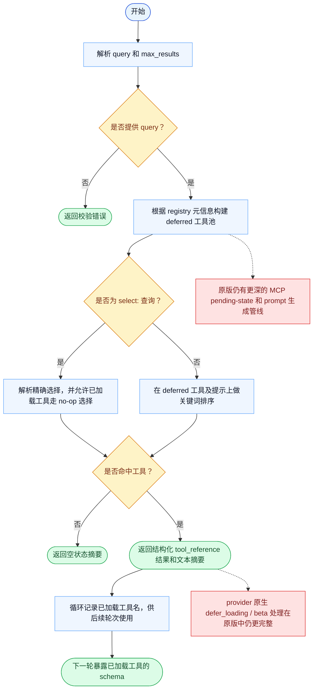

# ToolSearch 一致性报告

- 原版: `src/tools/ToolSearchTool/ToolSearchTool.ts`
- Go版: `tools/tool_search.go`

## 结论

- 摘要: 接口完全对齐；Go 现在已经通过隐藏 deferred 工具、支持 `select:`、返回结构化 tool reference、并在下一轮加载工具，把关键的延迟发现闭环对齐得更接近原版。

## 名称与描述

- 名称一致性: 完全一致。
- 描述一致性: 两边都把这个工具描述为用于发现 deferred 工具，并把这次发现转换成后续轮次里模型真正可见的工具可用性。 除“关键差异”外，措辞差别不影响核心语义。

## 参数与类型

- 类型签名: query: string，max_results?: number。
- 参数一致性: 顶层参数名与原版审计结果一致；字段顺序差异不构成语义差异。

## 实现概要

- 核心能力: 发现 deferred 工具，并把这次发现转换成后续轮次里模型真正可见的工具可用性。
- 典型场景: 适用于模型知道自己需要哪类能力，但完整 schema 应当只在选中或搜到该能力后才加载的场景。
- 核心痛点: 它解决的是工具面规模化问题：大批 deferred 工具不应该把每轮 prompt 都撑大，但模型仍需要一种安全的发现和加载方式。
- 主要挑战: 难点在于给工具元信息做排序、保持确定性的 `select:` 行为、返回模型可消费的发现结果，以及在跨轮次甚至压缩后维持 loaded-tool 状态。
- 实现思路一致性: 大体一致。两边现在都会延迟一部分工具、通过 ToolSearch 发现它们、发出结构化 tool reference，并在后续轮次暴露这些工具。原版仍有更深的 MCP pending-state、prompt 生成和 provider 专属发现管线。

## 流程图与决策地图

### 如何阅读这张图

- 先读蓝色主路径，用它理解共享的 happy path。
- 再看黄色菱形，它们是决定工具走哪条分支的判断条件。
- 最后看红色节点，它们标出 Go 与 `../src` 真正分叉的位置，或被有意排除的范围。

### 决策点

- `是否提供 query？` 用来在任何 registry 扫描前拒绝空的工具搜索请求。
- `是否为 select:<name> 查询？` 决定工具是走确定性的直接选择，还是走关键词排序发现。
- `是否命中工具？` 决定工具是输出结构化 tool reference，还是明确的空状态摘要。

### 差异热点

- Go 现在已经对齐了关键发现闭环：先隐藏 deferred 工具，再由 ToolSearch 发现，并把 loaded-tool 状态带到后续轮次。
- 剩余差距已经集中到 MCP pending-state 感知、更丰富的 prompt/description 生成，以及 provider 原生 defer-loading 基础设施。

## 输出与格式

- 输出对比: 原版返回以 tool reference 为核心的 typed 发现结果；Go 现在也会返回结构化 tool reference，并附带文本摘要，而不再只是纯文本列表。

## 关键差异

- 剩余差距主要集中在 pending MCP server 感知、provider 原生 defer-loading/beta 管线，以及更完整的原版 prompt/description 打分模型。
