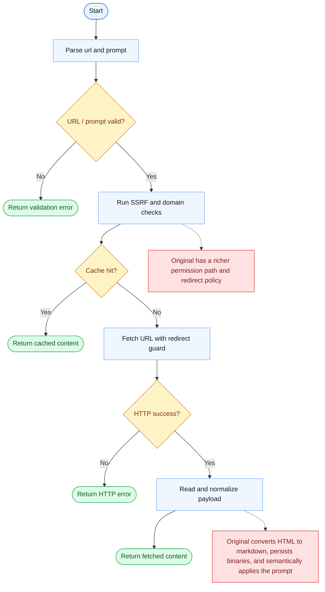

# WebFetch Parity Report

- Original: `src/tools/WebFetchTool/WebFetchTool.ts`
- Go: `tools/web.go`

## Verdict

- Summary: Exact surface; basic fetch behavior is aligned, but extraction and result modeling are still lighter in Go.

## Name And Description

- Name parity: exact.
- Description parity: Both versions describe the tool around the same core capability: Fetches one web page and prepares it for model consumption. Wording differences are minor unless called out under key gaps.

## Parameters And Types

- Type signature: url: string, prompt: string.
- Parameter parity: top-level parameter names match the original audit; ordering differences are non-semantic.

## Implementation Overview

- Core capability: Fetches one web page and prepares it for model consumption.
- Typical scenarios: Use it when the model needs content from a specific URL rather than a search result set.
- Core pain point addressed: It solves outside-information retrieval so the model can ground its answer in fetched web content instead of relying only on memory.
- Main challenges: The hard parts are network access, extraction quality, caching, and presenting the result in a model-friendly shape.
- Strategy consistency: Partially consistent. Both versions fetch or search the web first and then normalize the result, but the Go stack is still lighter than the original one.

## Visual Flow And Decision Map

### How To Read The Diagram

- Read the blue path first to understand the shared happy path.
- Read the yellow diamonds next; they are the branch conditions that decide which path the tool takes.
- Read the red boxes last; they mark exact places where Go diverges from `../src`, or where a path is intentionally out of scope.

### Decision Points

- `URL / prompt valid?` ensures the request is well-formed before any network access begins.
- `Cache hit?` decides whether the tool can stop at cached content or must perform a real fetch.
- `HTTP success?` determines whether the call returns an error result or continues to payload normalization.

### Flow-Divergence Hotspots

- The shared fetch path is already recognizable: validate, protect, fetch, normalize, return.
- The biggest parity gap is after fetch: the original has richer redirect / permission handling and actually uses the user prompt semantically, not just as echoed text.

## Output And Format

- Output comparison: The original returns a richer fetch result; Go returns plain text with a `Prompt:` header and extracted page content.

## Key Gaps

- Extraction quality and result modeling remain lighter in Go than in the original web stack.
