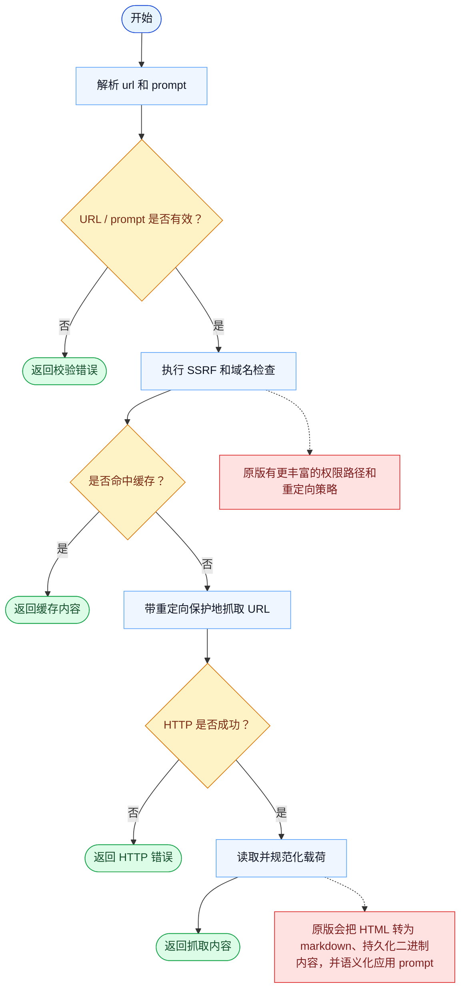

# WebFetch 一致性报告

- 原版: `src/tools/WebFetchTool/WebFetchTool.ts`
- Go版: `tools/web.go`

## 结论

- 摘要: 接口完全对齐；基础抓取行为已对齐，但内容抽取和结果建模在 Go 中仍然更轻。

## 名称与描述

- 名称一致性: 完全一致。
- 描述一致性: 两边都把这个工具描述为用于抓取一个网页，并把它整理成可供模型消费的结果。 除“关键差异”外，措辞差别不影响核心语义。

## 参数与类型

- 类型签名: url: string，prompt: string。
- 参数一致性: 顶层参数名与原版审计结果一致；字段顺序差异不构成语义差异。

## 实现概要

- 核心能力: 抓取一个网页，并把它整理成可供模型消费的结果。
- 典型场景: 适用于模型需要某个具体 URL 的内容，而不是搜索结果集合。
- 核心痛点: 它解决的是外部信息获取问题，让模型可以基于抓取到的网页内容作答，而不是只靠记忆。
- 主要挑战: 难点在于网络访问、抽取质量、缓存，以及把结果整理成适合模型消费的形态。
- 实现思路一致性: 部分一致。两边都先做网页抓取或搜索，再把结果规范化，但 Go 的这套栈仍比原版更轻。

## 流程图与决策地图

### 如何阅读这张图

- 先读蓝色主路径，用它理解共享的 happy path。
- 再看黄色菱形，它们是决定工具走哪条分支的判断条件。
- 最后看红色节点，它们标出 Go 与 `../src` 真正分叉的位置，或被有意排除的范围。

### 决策点

- `URL / prompt 是否有效？` 确保在任何网络访问开始前，请求形状已经正确。
- `是否命中缓存？` 决定工具是停在缓存内容上，还是必须执行真实抓取。
- `HTTP 是否成功？` 决定这次调用是直接返回错误结果，还是继续进行载荷规范化。

### 差异热点

- 共享抓取路径已经很清晰：校验、保护、抓取、规范化、返回。
- 最大的对齐差距在抓取之后：原版拥有更丰富的重定向 / 权限处理，并且会真正语义化使用用户 prompt，而不是仅仅把它回显出来。

## 输出与格式

- 输出对比: 原版返回更丰富的抓取结果；Go 返回带 `Prompt:` 头和抽取后页面内容的纯文本。

## 关键差异

- 内容抽取质量和结果建模在 Go 中仍比原版 web 栈更轻。
