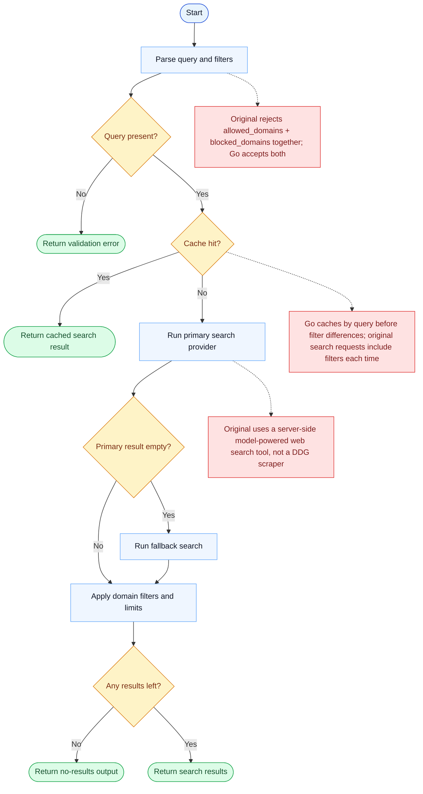

# WebSearch Parity Report

- Original: `src/tools/WebSearchTool/WebSearchTool.ts`
- Go: `tools/web.go`

## Verdict

- Summary: Exact surface; basic search behavior is aligned, but the underlying search stack is still lighter in Go.

## Name And Description

- Name parity: exact.
- Description parity: Both versions describe the tool around the same core capability: Searches the web and returns relevant results with optional domain filters. Wording differences are minor unless called out under key gaps.

## Parameters And Types

- Type signature: query: string, allowed_domains?: string[], blocked_domains?: string[].
- Parameter parity: top-level parameter names match the original audit; ordering differences are non-semantic.

## Implementation Overview

- Core capability: Searches the web and returns relevant results with optional domain filters.
- Typical scenarios: Use it when the model needs current external information but does not yet know the exact target URL.
- Core pain point addressed: It solves outside-information retrieval so the model can ground its answer in fetched web content instead of relying only on memory.
- Main challenges: The hard parts are network access, extraction quality, caching, and presenting the result in a model-friendly shape.
- Strategy consistency: Partially consistent. Both versions fetch or search the web first and then normalize the result, but the Go stack is still lighter than the original one.

## Visual Flow And Decision Map

### How To Read The Diagram

- Read the blue path first to understand the shared happy path.
- Read the yellow diamonds next; they are the branch conditions that decide which path the tool takes.
- Read the red boxes last; they mark exact places where Go diverges from `../src`, or where a path is intentionally out of scope.

### Decision Points

- `Query present?` rejects empty search requests early.
- `Cache hit?` decides whether the tool reuses prior search output or hits the provider again.
- `Primary result empty?` controls whether the fallback provider path is used.
- `Any results left?` is the final branch after filters and limits are applied.

### Flow-Divergence Hotspots

- The visible shape is still a search pipeline with provider call, fallback, filtering, and result formatting.
- The deepest parity break is architectural: the original search path is model-powered and server-side, while Go implements a DDG-style local search pipeline.
- Go also diverges on filter validation and cache-key semantics.

## Output And Format

- Output comparison: The original returns richer structured search results; Go returns a plain-text result set.

## Key Gaps

- Ranking, extraction, and broader web-stack integration remain lighter in Go.
