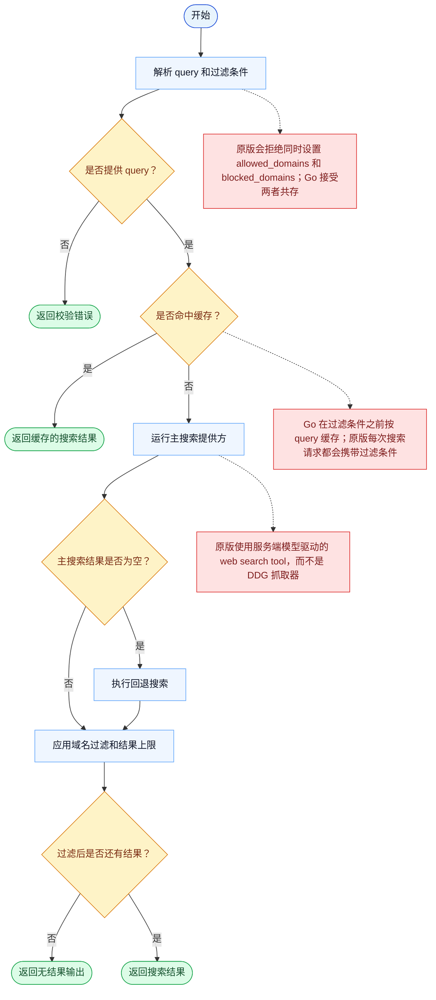

# WebSearch 一致性报告

- 原版: `src/tools/WebSearchTool/WebSearchTool.ts`
- Go版: `tools/web.go`

## 结论

- 摘要: 接口完全对齐；基础搜索行为已对齐，但底层搜索栈在 Go 中仍然更轻。

## 名称与描述

- 名称一致性: 完全一致。
- 描述一致性: 两边都把这个工具描述为用于搜索网页并返回相关结果，同时可附带域名白名单或黑名单过滤。 除“关键差异”外，措辞差别不影响核心语义。

## 参数与类型

- 类型签名: query: string，allowed_domains?: string[]，blocked_domains?: string[]。
- 参数一致性: 顶层参数名与原版审计结果一致；字段顺序差异不构成语义差异。

## 实现概要

- 核心能力: 搜索网页并返回相关结果，同时可附带域名白名单或黑名单过滤。
- 典型场景: 适用于模型需要当前外部信息，但还不知道确切目标 URL。
- 核心痛点: 它解决的是外部信息获取问题，让模型可以基于抓取到的网页内容作答，而不是只靠记忆。
- 主要挑战: 难点在于网络访问、抽取质量、缓存，以及把结果整理成适合模型消费的形态。
- 实现思路一致性: 部分一致。两边都先做网页抓取或搜索，再把结果规范化，但 Go 的这套栈仍比原版更轻。

## 流程图与决策地图

### 如何阅读这张图

- 先读蓝色主路径，用它理解共享的 happy path。
- 再看黄色菱形，它们是决定工具走哪条分支的判断条件。
- 最后看红色节点，它们标出 Go 与 `../src` 真正分叉的位置，或被有意排除的范围。

### 决策点

- `是否提供 query？` 用来尽早拒绝空搜索请求。
- `是否命中缓存？` 决定工具是复用先前搜索输出，还是再次访问提供方。
- `主搜索结果是否为空？` 控制是否进入回退提供方路径。
- `过滤后是否还有结果？` 是应用过滤条件和上限之后的最终分支。

### 差异热点

- 可见形状仍然是一条搜索流水线：调用提供方、回退、过滤、格式化结果。
- 最深的一处一致性断点是架构层面的：原版搜索路径是模型驱动、服务端执行的，而 Go 实现的是 DDG 风格的本地搜索流水线。
- 此外，Go 在过滤条件校验和缓存键语义上也存在分歧。

## 输出与格式

- 输出对比: 原版返回更丰富的结构化搜索结果；Go 返回纯文本结果集。

## 关键差异

- 结果排序、内容抽取和更宽的 web 栈集成在 Go 中仍然更轻。
