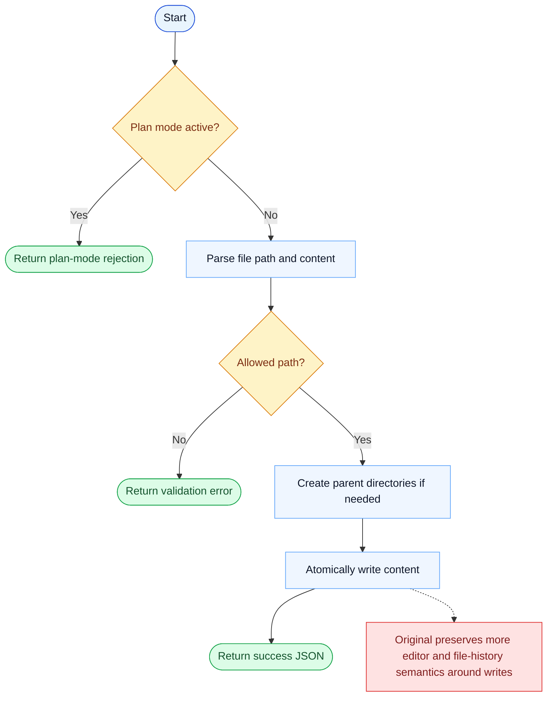

# Write Parity Report

- Original: `src/tools/FileWriteTool/FileWriteTool.ts`
- Go: `tools/file_operations.go`

## Verdict

- Summary: Exact surface; Go has a strong atomic-write path, but the original still preserves more editor and file-history semantics.

## Name And Description

- Name parity: exact.
- Description parity: Both versions describe the tool around the same core capability: Writes content to a file in one shot under tool-level path checks. Wording differences are minor unless called out under key gaps.

## Parameters And Types

- Type signature: file_path: string, content: string.
- Parameter parity: top-level parameter names match the original audit; ordering differences are non-semantic.

## Implementation Overview

- Core capability: Writes content to a file in one shot under tool-level path checks.
- Typical scenarios: Use it when the whole target file should be replaced rather than patched incrementally.
- Core pain point addressed: It addresses controlled full-file replacement: the model sometimes needs a clean overwrite rather than piecemeal edits.
- Main challenges: The hard parts are path safety, atomicity, and preserving enough surrounding semantics that the write is understandable and reversible.
- Strategy consistency: Largely consistent. Both versions implement file replacement as a guarded write operation.

## Visual Flow And Decision Map

### How To Read The Diagram

- Read the blue path first to understand the shared happy path.
- Read the yellow diamonds next; they are the branch conditions that decide which path the tool takes.
- Read the red boxes last; they mark exact places where Go diverges from `../src`, or where a path is intentionally out of scope.

### Decision Points

- `Plan mode active?` blocks writes while the runtime is still in read-only planning mode.
- `Allowed path?` is the main safety decision before any filesystem mutation happens.

### Flow-Divergence Hotspots

- The Go path is robust but short: validate, ensure parent dirs, atomically write, return JSON.
- The remaining difference is mostly in the richer original tooling around editor integration and write history semantics.

## Output And Format

- Output comparison: The original returns richer structured write metadata; Go returns a JSON string summary.

## Key Gaps

- The main gap is surrounding editor/file-history behavior rather than the raw overwrite itself.
