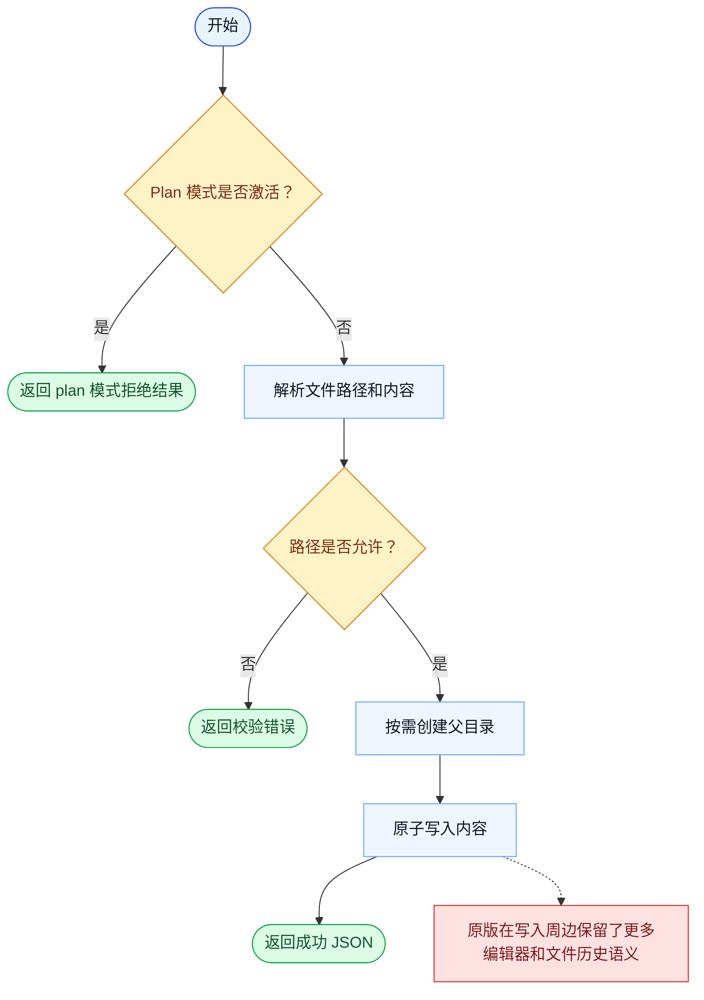

# Write 一致性报告

- 原版: `src/tools/FileWriteTool/FileWriteTool.ts`
- Go版: `tools/file_operations.go`

## 结论

- 摘要: 接口完全对齐；Go 已具备较强的原子写入路径，但原版仍保留更多 editor 与 file-history 语义。

## 名称与描述

- 名称一致性: 完全一致。
- 描述一致性: 两边都把这个工具描述为用于在工具级路径检查下，一次性把内容写入文件。 除“关键差异”外，措辞差别不影响核心语义。

## 参数与类型

- 类型签名: file_path: string，content: string。
- 参数一致性: 顶层参数名与原版审计结果一致；字段顺序差异不构成语义差异。

## 实现概要

- 核心能力: 在工具级路径检查下，一次性把内容写入文件。
- 典型场景: 适用于目标文件应被整体替换，而不是做增量补丁。
- 核心痛点: 它解决的是受控整文件替换问题：有时模型需要的是干净覆盖，而不是零碎编辑。
- 主要挑战: 难点在于路径安全、原子性，以及保留足够上下文语义，让这次写入可理解、可回退。
- 实现思路一致性: 大体一致。两边都把文件替换实现成带护栏的写入操作。

## 流程图与决策地图

### 如何阅读这张图

- 先读蓝色主路径，用它理解共享的 happy path。
- 再看黄色菱形，它们是决定工具走哪条分支的判断条件。
- 最后看红色节点，它们标出 Go 与 `../src` 真正分叉的位置，或被有意排除的范围。

### 决策点

- `Plan 模式是否激活？` 会在运行时仍处于只读规划模式时阻断写入。
- `路径是否允许？` 是任何文件系统变更发生前的主要安全判断。

### 差异热点

- Go 路径很稳，但很短：校验、确保父目录、原子写入、返回 JSON。
- 剩余差异主要还是原版在编辑器集成和写入历史语义周边的更丰富能力。

## 输出与格式

- 输出对比: 原版返回更丰富的结构化写入元信息；Go 返回 JSON 字符串摘要。

## 关键差异

- 主要差距在于外围 editor/file-history 行为，而不是原始覆盖写入本身。
